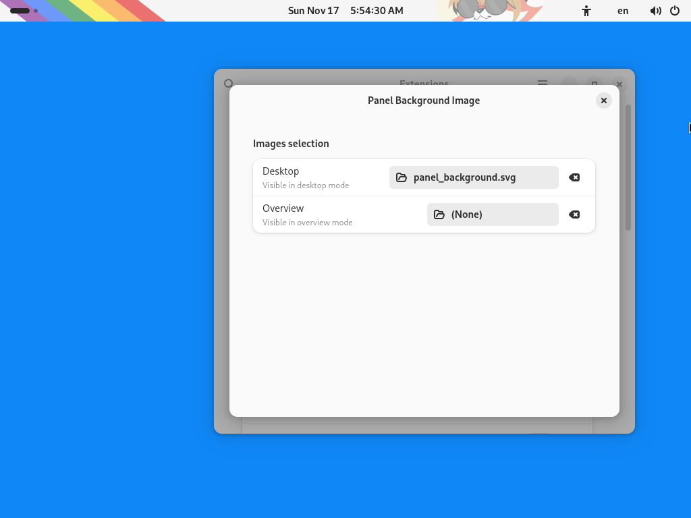

Panel Background Image for GNOME
================================================================================

How to install?
--------------------------------------------------------------------------------

Run this command.

	bash make.sh

How to use it?
--------------------------------------------------------------------------------

- Create an SVG image with a size matching the panel size.
- Select created image in extension settings.
